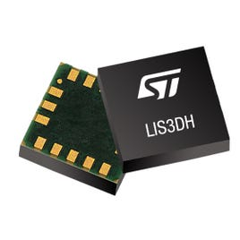

# [STMicroelectronics LIS3DH](https://www.st.com/en/mems-and-sensors/lis3dh.html)

Ultra-low-power 3-axis MEMS accelerometer

  

This library is developed with many focusing on weak-on-motion purpose. Please note that this library is not compatible with [LIS3DSH](https://www.st.com/en/mems-and-sensors/lis3dsh.html).
For wider capabilities such as tap detection, step counting [BMA400](https://github.com/rezaneam/BMA400) might be a better solution.

## Supported features

- I2C Interface support only
- Accepts custom TwoWire interface
- Auto address detector
- Basic configuration (range, sampling rate)
- Motion Detection Interrupt (with HPF)
- Basic Reading Acceleration
